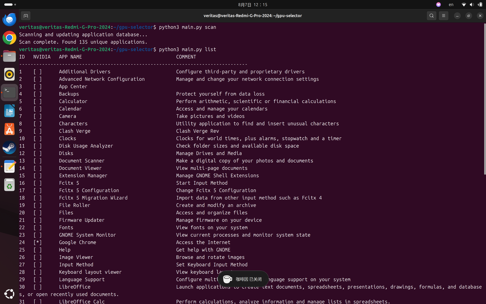
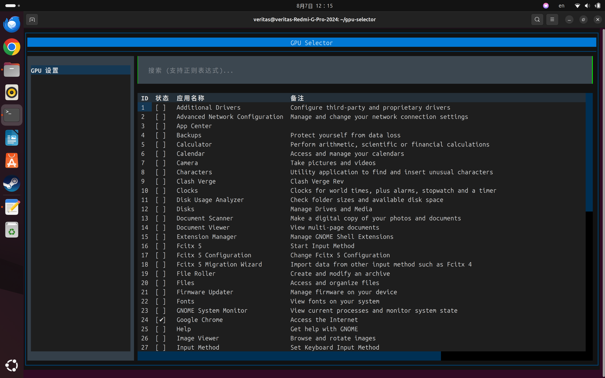

# Linux 桌面 GPU 选择器

**版本: 1.0**

## 1. 项目目标

使用Ubuntu的时候，我发现有些程序在Gnome和Kde桌面可以选择“用独立显卡启动”或者是“用集成显卡启动”，所以了解了一下.desktop文件的构成，写了这个程序方便设置

本工具旨在为 Linux 桌面用户提供一个简单、健壮且安全的命令行界面，用于管理哪些应用程序应优先使用独立显卡（例如 NVIDIA GPU）进行渲染。它严格遵循 Freedesktop.org 的 `.desktop` 文件规范，并尊重系统原有的应用程序覆盖机制。

开发此工具的主要动机是提供一种比设置全局环境变量更精细的控制方式，允许用户仅为特定、对性能要求较高的应用程序（如游戏、网页浏览器或创意软件）启用高性能渲染。

## 2. 核心设计与逻辑

本程序是一个 Python 脚本，它使用一个 SQLite 数据库来维护系统上可用应用程序的清晰准确表示。

### 数据库 (`~/.config/gpu-selector/gpu_selector.db`)

-   一个中心化的 SQLite 数据库用于存储应用程序信息。
-   每个应用程序的**唯一标识符**是其 `.desktop` 文件的**基本名称**（例如 `google-chrome.desktop`），这正确反映了桌面环境的覆盖行为。
-   数据库跟踪应用程序的名称、其当前活动的文件路径，以及是否已应用用户自定义设置。

### 关键命令与逻辑

-   **`scan`**: 此命令用于构建和更新应用程序数据库。
    -   它执行**两阶段扫描**：
        1.  首先扫描所有系统级应用程序目录（例如 `/usr/share/applications`、`/var/lib/snapd/desktop/applications` 等）。
        2.  然后扫描用户本地目录（`~/.local/share/applications`）。在此处找到的条目会**覆盖**任何具有相同基本名称的系统级条目。
    -   这确保了数据库准确反映桌面环境对可用应用程序的视图，并有效避免了重复。

-   **`set <app_name>`**: 此命令为应用程序启用高性能 GPU 偏好。
    -   它**绝不修改系统文件**，确保操作的安全性。
    -   它使用 Python 的 `configparser` 库安全地解析原始 `.desktop` 文件的 INI 结构。
    -   它在 `[Desktop Entry]` 部分中添加或修改 `PrefersNonDefaultGPU=true` 键。
    -   它将完整、修改后的内容写入 `~/.local/share/applications/` 中的**新文件**。
    -   这种方法正确保留了原始文件的所有部分（包括 `[Desktop Action]` 条目），并避免了所有先前发现的兼容性问题。

-   **`unset <app_name>`**: 此命令将应用程序恢复到其默认设置。
    -   它简单地**删除** `~/.local/share/applications/` 中的自定义 `.desktop` 文件。
    -   桌面环境随后会自动回退到使用原始的系统级文件。

-   **`list`**: 显示 `scan` 命令找到的所有唯一应用程序，并用 `[*]` 符号清晰标记已自定义的应用程序。

## 3. 如何使用

*此工具不需要 `sudo` 权限，应作为普通用户运行。*

### 使用截图

 



### 交互式 TUI (推荐)

为了获得最佳体验，您可以使用交互式文本用户界面（Textual UI）。

1.  **安装依赖**: 首先，安装所需的 Python 库。
    ```bash
    pip install -r requirements.txt
    ```

2.  **运行 TUI**:
    ```bash
    python3 main.py tui
    # 或者直接运行:
    python3 main.py
    ```

    在 TUI 内部，您可以：
    -   使用 **上/下箭头** 或 **k/j** 键导航列表。
    -   在搜索框中输入以过滤应用程序（支持正则表达式）。
    -   按 **空格键** 设置/取消设置选中应用程序的 NVIDIA 偏好。
    -   按 **R** 刷新应用程序列表。
    -   按 **Ctrl+C** 两次（在短时间内）退出程序。

### 自动化扫描 (Systemd 用户服务，建议先别用，没打包呢可能会缺失库，唉唉Python)

为了确保应用程序数据库始终保持最新，而无需手动运行 `scan` 命令，安装一个 `systemd` 用户服务。此服务将在应用程序安装、更新或删除时自动触发扫描。

1.  **安装服务**:
    ```bash
    python3 main.py install-service
    ```
    这将在 `~/.config/systemd/user/` 目录下创建两个文件：`gpu-selector-scan.service` 和 `gpu-selector-scan.path`。

2.  **启用并启动服务**:
    请按照屏幕上的指示操作，通常是：
    ```bash
    systemctl --user daemon-reload
    systemctl --user enable --now gpu-selector-scan.path
    ```

3.  **卸载服务**:
    要移除服务，只需运行：
    ```bash
    python3 main.py uninstall-service
    ```
    然后按照提示运行 `systemctl --user daemon-reload`。

### 命令行界面 (CLI)

1.  **首次扫描 (必需)**: 在首次使用前，或在安装/卸载应用程序后，运行 `scan` 命令以保持数据库最新。
    ```bash
    python3 main.py scan
    ```

2.  **列出应用程序**: 查看所有检测到的应用程序及其当前的 GPU 偏好状态。
    ```bash
    python3 main.py list
    ```

3.  **设置应用程序优先使用 NVIDIA**: 您可以使用应用程序的名称或列表中显示的 ID。
    ```bash
    # 通过名称
    python3 main.py set "Google Chrome"
    
    # 通过 ID
    python3 main.py set 42
    ```

4.  **重置应用程序为默认**: 您也可以使用名称或 ID。
    ```bash
    # 通过名称
    python3 main.py unset "Google Chrome"
    
    # 通过 ID
    python3 main.py unset 42
    ```


